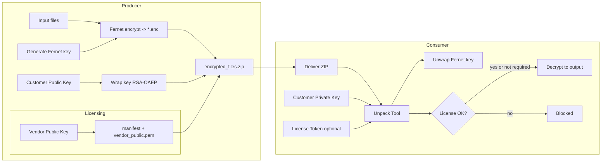

Key flows:
- Files are encrypted symmetrically (Fernet), and the Fernet key is wrapped with the customer’s RSA public key (RSA-OAEP SHA-256).
- The zip contains only ciphertext (*.enc), the wrapped key, and optionally licensing manifest/vendor public key.
- At decrypt time, the customer’s private key unwraps the Fernet key; licensing (if present) is verified before decryption proceeds.

